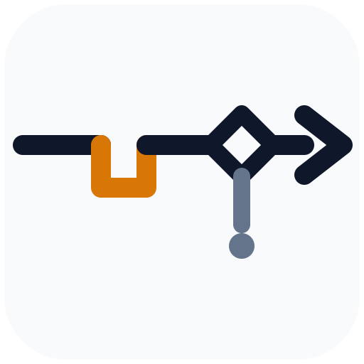

# DEFAIL



**Deterministic Embedded Failure Addressing Inference Logic.**

DEFAIL is an inference/control layer that makes failures deterministic,
attributable, and actionable, rather than letting them propagate as vague
errors. Failure is treated as an inference problem with structured resolution,
not merely an exception.

A conventional error handler says:

```
ConnectionError: request failed
```

DEFAIL says:

```
Failure: provider request rejected
Class: capacity/rate-limit
Evidence: http_status=429 + quota_header=present
Confidence: 0.98
Resolution: switch to provider B
Constraint: preserve capability generation at tier >= 3
Verification: provider B accepted an equivalent request
Disposition: recovered
```

## The pipeline

```
execution → detection → classification → causal inference
         → remediation selection → policy validation
         → remediation execution → verification → resume / escalate
```

## The determinism contract

Inference **proposes**; deterministic policy **validates**; remediation
**executes**; an invariant **verifies**:

```
observed failure
      ↓
inference (class + cause + confidence, from declared signal patterns)
      ↓
candidate remediation (knowledge base first, then declared precedence)
      ↓
policy / capability constraints (substitution windows, capability tiers)
      ↓
deterministic action (host executes the permitted remedy)
      ↓
verification (declared predicate + the operation must actually resume)
      ↓
known state → resume, or escalate
```

If inference cannot produce a remediation that satisfies the constraints the
component declared, DEFAIL escalates. It does not hallucinate its way through
the failure — and an observation that matches no declared failure mode at the
declared minimum confidence is escalated as `unclassified` rather than
guessed at.

## Embedded: components declare themselves

Each component embeds a `ComponentSpec`: its capabilities, failure modes
(diagnostic signal patterns, permitted remediations, verification
predicates, minimum confidence), and remedies with the constraints under
which each is valid.

## Addressable contextual understanding of self at the point of error

Every operation has an address (`Baker.recipe.combine`). `ExecutionState` is
an addressable model of the execution graph, so at a point of failure DEFAIL
retrieves the relevant local state, upstream state, and applicable
constraints, and can answer: *where am I, what have I done, what remains
possible, and what must I do now?*

The Baker example is the canonical demonstration:

- Baking soda found missing **before** the batter is committed → the
  substitution window is still open → substitute yeast (with the adjusted
  proof time), verify leavening capability is preserved, resume.
- The same ingredient found missing **after** the batter is in the oven →
  the substitution window has expired → the recipe is frozen and the only
  permitted recovery is the constrained (dense-bake) procedure.

## DEFAIL ENFORCE

`Enforcer` is the gate that prevents the application from continuing
incorrectly after a failure: an operation may only run when its
prerequisites are done and no earlier failure stands unresolved. That is
what stops `continue_to_bake()` until a valid recovery state has been
established. Prerequisites are the plan steps declared before the operation
plus its direct `requires` edges (transitively-declared prerequisites are
not individually gated on), and a cycle in the transitive closure of
`requires` is reported as `GateReason::CyclicPrerequisites` — a cycle can
never complete, so the gate denies the operation with the cycle named
instead of gating forever.

## Learning

Every resolution attempt updates the `KnowledgeBase`
(`failure class + context → remediation → verification → outcomes`). If the
same failure happens 100 times, the system does not invent 100 responses; a
demonstrably successful remediation is recommended directly next time.
When the same key is later learned under a *different* remedy id, the
divergence is recorded on the entry (`alt_remedies`) instead of being
silently attributed to the first-learned remedy. Records round-trip through
a versioned line format (`defail-kb v2` header, all fields backslash-escaped
so `|`/newlines round-trip); v1 banks are still read for backward
compatibility, duplicate keys keep last-wins but are reported through the
load report, and banks from separate runs merge with `absorb` — a
deterministic join: for every remedy mentioned on either side the strongest
recorded outcome wins (more successes, then fewer failures, then remedy
id), the stronger of the two primary remedies leads the merged entry, and
the rest remain as alternative-remedy counts. The join is commutative, associative,
and idempotent: banks merge in any order and re-merging an already-merged
bank changes nothing.

Declarations are validated: a failure mode with a non-positive or
non-finite pattern weight, a `min_confidence` outside `[0, 1]`, or an
empty `permitted` remedy list fails loudly at construction time
(`DeclarationError`, `ComponentSpec::validate`, `DeFail::try_new`) instead
of classifying silently. The compatibility constructor `DeFail::new` keeps
running on an invalid spec but the invalid failure modes can never classify
— the skip is recorded as a `declaration_skipped` trace event — so a
hand-built spec can never make every observation "match" at confidence 1.0.

## Observability: event trace and versioned JSON exports

Every decision the pipeline makes is emitted in order as a `TraceEvent`:
classify / escalate-unclassified, remedy selected / rejected (with the stage:
policy pre, apply, resume, policy post, verification), applied, resumed,
verified, learned, exhausted — plus `GateDenied` when the gate refuses an
operation. Events carry addresses, ids, and decision data only; they never
carry signal payloads or host state (the report's `evidence` field remains the
attributable diagnostic channel).

- The engine records every event internally (`DeFail::trace()`), and each
  `FailureReport` carries the events of its own resolution in `report.trace`.
- Hosts can additionally stream events anywhere with a `TraceSink`
  (`DeFail::with_sink(...)`); `NoopSink` is the default and `VecSink` records.
- `FailureReport::to_json()` exports `"schema": "defail-report/1"` and
  `KnowledgeBase::to_json()` exports `"schema": "defail-kb/2"` (matching the v2
  record format), both via the hand-rolled, escaping-correct `json` module —
  zero dependencies, byte-for-byte deterministic output.
- `defail demo ... --json` prints the human report first, then each failure
  report as JSON; `defail kb show --json <PATH>` prints the bank export.
  Exit codes are unchanged.

## Persistence: bank, with a PATH-free fallback

`KnowledgeStore` persists a knowledge bank to disk. Path creation prefers
the `bank` utility (mkdir + touch in one step, resolved via `PATH`): `bank -p -f`
creates the parent directories and the file. When bank is not installed —
or its invocation fails for any reason — the store falls back to
`std::fs::create_dir_all` (the `mkdir -p` equivalent): no external process,
no `PATH` surface. Both backends produce identical records; `save` reports
which backend actually wrote the file.

The content itself is always written the same way: staged into a temporary
file in the destination directory with `create_new(true)` (no
predictable-name symlink surface), fsynced, atomically renamed onto the
target, and the directory is fsynced after the rename — a failure mid-save
never truncates the previously saved bank, and a symlinked target is
replaced rather than written through. Staging names are pid+sequence
deterministic by design (reproducibility); they are never random, and
blocking saves by pre-creating them requires write access to the
destination directory, which is out of scope for the single-threaded
embedded threat model (the destination directory is host-controlled).

Note: only `Backend::Bank` executes an external tool (`bank`, resolved via
`PATH`). The `Backend::CpMkdir` fallback is fully PATH-free. Hosts that
cannot trust `PATH` should select the fallback explicitly:

```rust
let store = KnowledgeStore::with_backend(".defail/knowledge", Backend::CpMkdir);
```

Format ambiguity, accepted by design: a v1 bank (no header) whose first
record is literally `defail-kb v2` has that line consumed as the format
header and the rest parsed as v2 records; the loader does not heuristic-
parse around this (determinism wins). Banks written by this crate always
escape `\r`, so hand-editing a bank with CRLF line endings is the only way
to corrupt trailing carriage returns.

```rust
use defail::store::{KnowledgeStore, Backend};

let store = KnowledgeStore::new(".defail/knowledge"); // auto-detects bank
let used = store.save(engine.knowledge())?;           // Backend::Bank | Backend::CpMkdir
let kb = store.load()?;                               // KnowledgeBase
```

## Run it

```sh
cargo run -- demo            # all four reference scenarios
cargo run -- demo baker      # early discovery → substitution
cargo run -- demo baker --late       # late discovery → constrained proceed
cargo run -- demo provider          # rate limit → fallback, recovered
cargo run -- demo provider --degraded  # escalation + gated downstream op
cargo run -- demo provider --save-kb .defail/knowledge  # persist what was learned
cargo run -- demo baker --late --json  # human report, then defail-report/1 JSON
cargo run -- kb show .defail/knowledge                  # print a knowledge bank
cargo run -- kb show --json .defail/knowledge           # defail-kb/2 JSON export
cargo run --example baker
cargo test
```

`--save-kb <PATH>` applies path discipline: the path must be non-empty and
its normalized form must stay inside the current directory — `..` above the
working directory and absolute paths outside it are refused with a usage
error (exit code 2). This check is lexical; it does not resolve symlinks.
`--json` never changes exit codes.

## Use it as a library

```rust
use defail::{DeFail, Enforcer, ComponentSpec, ExecutionState, PlanStep, OpAddress};

// 1. Declare the component: capabilities, failure modes, remedies.
let spec: ComponentSpec = my_component_spec();

// 2. Implement AppWorld: execute steps, apply remedies, expose signals.
//    `apply_remedy` reports refusals as the typed `RemedyError`
//    (`.into()` from a `String`/`&str` reason is enough).
let mut world = MyWorld::new();

// 3. Plan the addressable execution graph.
let mut state = ExecutionState::new(vec![PlanStep::new(
    OpAddress::new("MyApp.do_work").unwrap(),
    "the work",
)]);

// 4. Run every step under DEFAIL + ENFORCE.
let mut enforcer = Enforcer::new(DeFail::new(spec));
enforcer.engine_ref().seed_capabilities(&mut state);
let outcome = enforcer
    .run_step(&mut world, &mut state, &OpAddress::new("MyApp.do_work").unwrap())
    .unwrap();
```

`Forbidden: unsafe code` — the crate is pure, dependency-free Rust.

## API stability policy

DEFAIL is pre-1.0 (0.2.x): breaking changes are allowed, but they are
recorded — each lands with a roadmap entry and, where it changes behavior,
an audit note. The stable surface is what the crate root re-exports
(`defail::{DeFail, Enforcer, ComponentSpec, ExecutionState, …}`) plus the
documented contracts in [ARCHITECTURE.md](ARCHITECTURE.md): the pipeline
order, the determinism and threading contracts, the persistence formats
(`defail-kb v2` records, `defail-report/1` / `defail-kb/2` JSON), and the
gate semantics. Module internals — private helpers, field layout, items not
re-exported — are free to evolve between minor versions without a
changelog entry. Patch releases never change behavior.

## Module map

| Module | Role |
|---|---|
| `address` | `OpAddress`: addressable points of the execution graph |
| `signal` | diagnostic signals, observations, declared signal patterns |
| `declare` | embedded declarations: failure modes, remedies, constraints, verification |
| `state` | `ExecutionState`: the addressable model of application state |
| `inference` | deterministic classification and causal confidence |
| `policy` | constraint validation before and after remediation |
| `knowledge` | the learned `failure → remediation → verification` map |
| `store` | knowledge persistence: `bank` primary, PATH-free `create_dir_all` fallback, atomic staging rename |
| `report` | structured `FailureReport` (the doc-format output), versioned JSON export |
| `trace` | `TraceEvent` decision trace, `TraceSink`/`NoopSink`/`VecSink` |
| `json` | the hand-rolled, escaping-correct JSON writer behind every export |
| `engine` | the resolution pipeline; `AppWorld` host boundary |
| `enforce` | the gate: prerequisite closure, cycle detection, no downstream progress without valid recovery state |
| `demo` | Baker and Provider reference scenarios |
